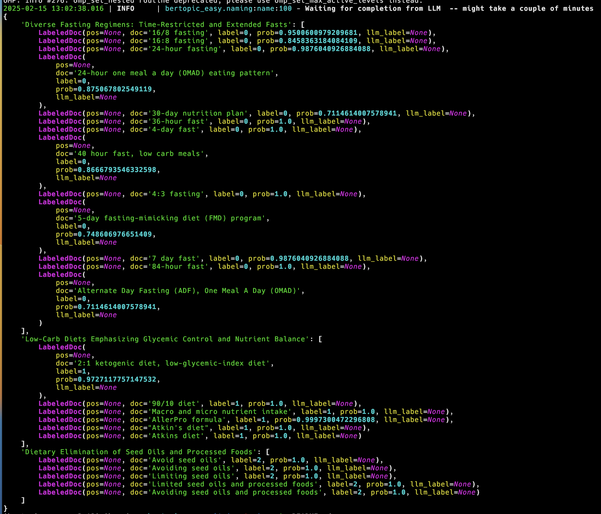
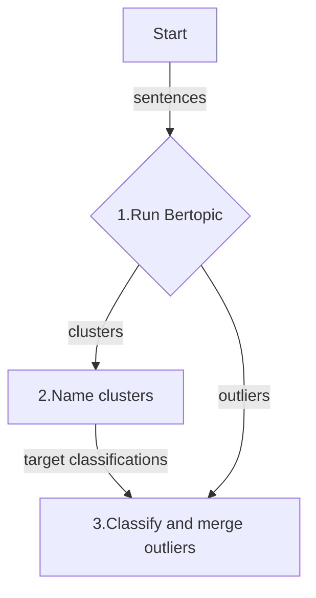

# BERTopic Easy

## Intent

Two intents:

1. The first intent of this library is to give you a shortcut to quickly prototype how
   your text data can be transformed into topics, before diving into the more
   powerful, but complex, BERTopic library.
2. The second intent is to show case a simple, but effective, hybrid approach that
   combines embeddings and LLM completions for topic modeling.

## Anecdotal observations motivating this library

-   [BERTopic](https://maartengr.github.io/BERTopic/index.html) is one of the
    premier libraries for topic modeling, but its complicated and its default
    settings for reducing outlier sentences did not work well for me.
-   **OpenAI's `o3-mini`** for outlier classification appears to be better than
    BERTopic's `reduce_outliers` tool
-   **OpenAI's `o3-mini`** for naming topics is better than GPT4o. GPT4o made near dupe cluster names, where as `o3-mini` made more unique names since it can name wholistically.
-   Fine-tuning an embedding model is expensive and might not be needed with `o1-mini`.
-   Agglomerative clustering gave poor quality results and can't scale, O(n^2).
-   Its uncertain how the prompt approach here can scale. It may require special prompt engineering with chunks. Maybe a crowd-sourced approach to prompt engineering to solve this problem could be a solution.

### Quick start

-   `git clone` this repo
-   `cd` to the root of the repo
-   set `OPENAI_API_KEY` as an environment variable or in a `.env` local file
-   `poetry install`
-   `poetry shell` # to activate the virtual environment, if needed
-   `poetry run python demo.py`

## Demo Example

```python

import os

from dotenv import load_dotenv
from openai import OpenAI
from rich import print

from bertopic_easy.cluster import cluster
from bertopic_easy.naming import name

load_dotenv()

sentences = [
    "16/8 fasting",
    "16:8 fasting",
    "24-hour fasting",
    "24-hour one meal a day (OMAD) eating pattern",
    "2:1 ketogenic diet, low-glycemic-index diet",
    "30-day nutrition plan",
    "36-hour fast",
    "4-day fast",
    "40 hour fast, low carb meals",
    "4:3 fasting",
    "5-day fasting-mimicking diet (FMD) program",
    "7 day fast",
    "84-hour fast",
    "90/10 diet",
    "Adjusting macro and micro nutrient intake",
    "Adjusting target macros",
    "Macro and micro nutrient intake",
    "AllerPro formula",
    "Alternate Day Fasting (ADF), One Meal A Day (OMAD)",
    "American cheese",
    "Atkin's diet",
    "Atkins diet",
    "Avoid seed oils",
    "Avoiding seed oils",
    "Limiting seed oils",
    "Limited seed oils and processed foods",
    "Avoiding seed oils and processed foods",
]

openai = OpenAI(api_key=os.environ.get("OPENAI_API_KEY"))

clusters = cluster(
    bertopic_kwargs=dict(min_topic_size=4),
    docs=sentences,
    openai=openai,
    embed_llm_name="text-embedding-3-large",
    with_disk_cache=True,
)


named_clusters = name(
    clusters=clusters,
    openai=openai,
    llm_model_name="o3-mini",
    reasoning_effort="low",
    subject="personal diet intervention outcomes",
)
print(named_clusters)

```



## What's happening under the hood? The three steps...

This is a opinionated hybrid approach to topic modeling using a combination of
embeddings and LLM completions. The embeddings are for clustering and the LLM
completions are for naming and outlier classification.



### Step 1 - Cluster sentences

Bertopic library clusters using embeddings from a `text-embedding-3-large` LLM model.

### Step 2 - Name clusters

Names are generated by a `o3-mini` LLM model for the resulting clusters from **Step 1**.

### Step 3 - Re-group outliers

Outlier sentences, those that did not fit into any of the Bertopic clusters
from **Step 1**, are classified by the `o3-mini` LLM using the resulting
cluster names from **Step 2**.

## Developer smoke test

```bash

poetry run pytest

```
