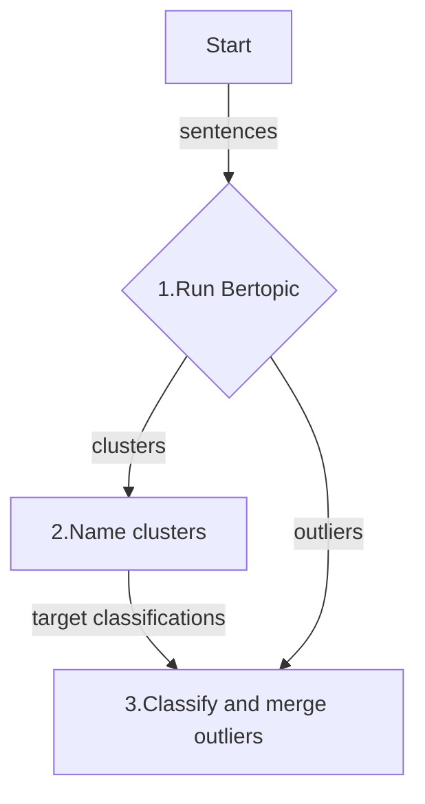

# BERTopic Easy

## Motivations

-   [BERTopic](https://maartengr.github.io/BERTopic/index.html) is one of the
    premier libraries for topic modeling, but its complicated and its default
    settings for reducing outlier sentences did not work well for me.
-   **OpenAI's `o3-mini`** for outlier classification appears to be better than
    BERTopic's `reduce_outliers` tool
-   **OpenAI's `o3-mini`** for naming topics is better than GPT4o. GPT4o made near dupe cluster names, where as `o3-mini` made more unique names since it can name wholistically.
-   Fine-tuning an embedding model is expensive and might not be needed with `o1-mini`.
-   Agglomerative clustering gave poor quality results and can't scale, O(n^2).
-   Its uncertain how the prompt approach here can scale. It may require special prompt engineering with chunks. Maybe a crowd-sourced approach to prompt engineering to solve this problem could be a solution.

## Example usage

```python
from bertopic_easy.main import bertopic_easy

openai = OpenAI(api_key=os.environ.get("OPENAI_API_KEY"))
async_openai = AsyncOpenAI(api_key=os.environ.get("OPENAI_API_KEY"))

clusters = bertopic_easy(
    texts=diet_actions,
    openai=openai,
    async_openai=async_openai,
    reasoning_effort="low",
    subject="personal diet intervention outcomes",
)
print(clusters)
```

## Example output


## What's happening under the hood? The three steps...

This is a opinionated hybrid approach to topic modeling using a combination of
embeddings and LLM completions. The embeddings are for clustering and the LLM
completions are for naming and outlier classification.



### Step 1 - Cluster sentences

Bertopic library clusters using embeddings from a `text-embedding-3-large` LLM model.

### Step 2 - Name clusters

Names are generated by a `o3-mini` LLM model for the resulting clusters from **Step 1**.

### Step 3 - Re-group outliers (not implemented yet)

Outlier sentences, those that did not fit into any of the Bertopic clusters
from **Step 1**, are classified by the `o3-mini` LLM using the resulting
cluster names from **Step 2**.

### Install

-   `git clone` this repo
-   `cd` to the root of the repo
-   set `OPENAI_API_KEY` as an environment variable or in a `.env` local file
-   `poetry install`
-   `poetry shell` # to activate the virtual environment, if needed
-   `poetry run python demo.py`

## Run smoke test

```shell

poetry run pytest tests/test_main.py::test_bertopic_easy
```
